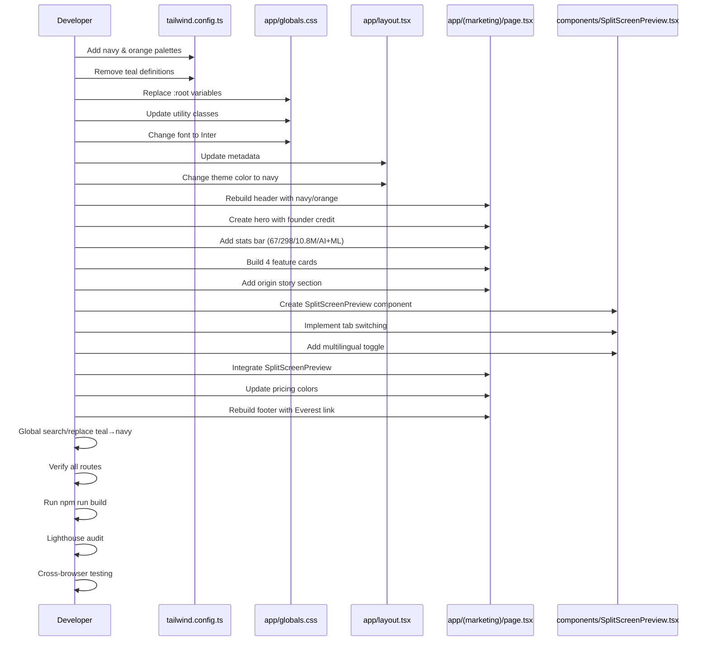

# Plan

## Observations

The current ZoneWise.AI website uses teal (#0D9488) branding focused on Brevard County only. The rebrand requires a complete visual and content transformation to navy (#1E3A5F) and orange (#F59E0B) colors, expanding scope from 17 Brevard jurisdictions to all 67 Florida counties. The root cause is that commit `976acc9c` updated documentation but never touched actual code files. The site currently has hardcoded teal values throughout `file:tailwind.config.ts`, `file:app/globals.css`, `file:app/layout.tsx`, and `file:app/(marketing)/page.tsx`. Additionally, content must shift from zoning-only to a comprehensive platform covering foreclosure, tax deed, zoning, and ML predictions, with prominent founder credit and Everest Capital USA integration.

## Approach

This plan follows a systematic bottom-up approach: first establish the design system foundation (colors, typography) in Tailwind and CSS variables, then update metadata and theme configuration, and finally rebuild the marketing page with new content, stats, features, and components. The strategy ensures zero teal remnants by replacing all color references systematically, then layering in new content that reflects the 67-county statewide scope, Claude Opus 4.6 capabilities, and proper attribution to Ariel Shapira and Everest Capital USA. A new `SplitScreenPreview` component will be created as a static mockup showcasing the multilingual chatbot and tabbed panels without live functionality.

## Implementation Instructions

### Phase 1: Color System Foundation

#### 1.1 Update Tailwind Configuration (`file:tailwind.config.ts`)

Extend the Tailwind theme with complete navy and orange color palettes:

- **Navy palette**: Add shades 50, 100, 200, 300, 400, 500 (#1E3A5F primary), 600 (#1E3A5F primary), 700, 800, 900
- **Orange palette**: Add shades 300, 400, 500 (#F59E0B primary), 600, 700
- Remove any existing teal color definitions
- Ensure the configuration extends the default theme rather than replacing it
- Verify Inter font is configured (should already be present in Next.js 13+)

#### 1.2 Rebuild CSS Variables (`file:app/globals.css`)

Replace the entire `:root` block with navy and orange variables:

- **Primary colors**: `--navy-50` through `--navy-900`, `--orange-300` through `--orange-700`
- **Semantic variables**: `--primary: var(--navy-600)`, `--accent: var(--orange-500)`
- **Remove all teal variables**: Search and destroy all `--teal-*` references
- **Update utility classes**: 
  - Selection background to navy with orange text
  - Focus rings to orange
  - Scrollbar thumb to navy
  - Gradient text utilities to use navy-to-orange gradients
- **Font import**: Replace DM Sans with Inter from Google Fonts
- Verify dark mode variables if present use navy/orange equivalents

### Phase 2: Metadata & Theme Configuration

#### 2.1 Update Root Layout (`file:app/layout.tsx`)

Modify metadata and theme configuration:

- **Title**: "ZoneWise.AI - Florida's AI-Powered Real Estate Intelligence"
- **Description**: Include keywords: 67 Florida counties, foreclosure intelligence, tax deed analysis, zoning, ML predictions, Claude Opus 4.6
- **Theme color**: Change from `#0D9488` to `#1E3A5F`
- **Font**: Verify Inter font is imported and applied (Next.js 13+ uses `next/font/google`)
- **Viewport**: Ensure responsive meta tags are present
- Scan for any hardcoded teal color values in className props and replace with navy equivalents

### Phase 3: Marketing Page Reconstruction

#### 3.1 Header Component (`file:app/(marketing)/page.tsx`)

Create or update the header section:

- **Logo**: Navy primary color with orange accent dot
- **Navigation**: Sticky header with navy background, white text
- **Links**: Login, Signup, Pricing, About
- **Mobile menu**: Hamburger icon with navy/orange theme
- Apply `bg-navy-900`, `text-white`, `sticky top-0 z-50` classes

#### 3.2 Hero Section

Build the hero with founder attribution and Everest Capital link:

- **Headline**: "Florida's AI-Powered Real Estate Intelligence"
- **Subheadline**: "Distressed Assets Decoded. For Everyone. Everywhere."
- **Badge**: Orange badge with "Powering Everest Capital USA" linking to `https://everestcapitalusa.com`
- **Founder credit**: "Founded by Ariel Shapira, Inventor & Founder" in prominent position
- **CTA buttons**: 
  - Primary: Navy background (`bg-navy-600 hover:bg-navy-700`)
  - Secondary: Orange border (`border-orange-500 text-orange-500 hover:bg-orange-50`)
- **Background**: Navy gradient or solid navy-900
- Use Tailwind classes: `text-4xl md:text-6xl font-bold`, `text-orange-500` for accents

#### 3.3 Stats Bar

Create a stats section with navy background and orange numbers:

- **Container**: `bg-navy-900 py-12`
- **Grid**: 4 columns on desktop, 2 on tablet, 1 on mobile
- **Stats**:
  1. **67** - "Florida Counties"
  2. **298** - "Intelligence KPIs"
  3. **10.8M** - "Parcels Analyzed"
  4. **AI+ML** - "Powered Intelligence"
- **Number styling**: `text-orange-500 text-5xl font-bold`
- **Label styling**: `text-white text-sm uppercase tracking-wide`

#### 3.4 "Our Edge" Feature Cards

Build 4 feature cards in a responsive grid:

1. **Foreclosure Intelligence** (🏛️)
   - Automated lien discovery
   - Title search automation
   - Judgment analysis
   
2. **Tax Deed Analysis** (📜)
   - Certificate tracking
   - Redemption period monitoring
   - Surplus probability scoring

3. **Zoning & Land Use** (🏗️)
   - 3D building envelopes
   - Highest & Best Use analysis
   - Setback calculations

4. **ML Predictions** (🤖)
   - XGBoost probability scoring
   - Market trend analysis
   - Risk assessment models

**Card styling**:
- Border: `border-navy-300`
- Hover: `hover:border-orange-500 hover:shadow-lg transition-all`
- Icon: Orange color (`text-orange-500 text-4xl`)
- Title: Navy (`text-navy-900 font-bold text-xl`)
- Grid: `grid grid-cols-1 md:grid-cols-2 lg:grid-cols-4 gap-6`

#### 3.5 Origin Story Section

Add narrative section about Ariel Shapira:

- **Headline**: "Built by a Florida Real Estate Veteran"
- **Content**: Highlight 20+ years of Florida real estate experience, invention background
- **Layout**: Two-column on desktop (text + image placeholder)
- **Styling**: White background with navy text, orange accent underlines
- Use `prose` classes for typography if Tailwind Typography plugin is available

#### 3.6 Split-Screen Preview Component

Create new component `file:components/SplitScreenPreview.tsx`:

**Layout structure**:
```
┌──────────────────────┬───────────────────────────────────────────┐
│                      │  [🗺️ MAP] [📅 CALENDAR] [📊 ANALYTICS]   │
│  🤖 MULTILINGUAL     ├───────────────────────────────────────────│
│     NLP CHATBOT      │  Panel 1: Mapbox Heatmap (static image)  │
│  EN | ES | HE | RU   │  Panel 2: Auction Calendar (static grid) │
│                      │  Panel 3: Market Analytics (static cards) │
└──────────────────────┴───────────────────────────────────────────┘
```

**Left panel (40% width)**:
- Static chat interface mockup
- Language toggle buttons: EN | ES | HE | RU
- Sample chat messages showing multilingual capability
- Navy background with white text
- Orange accents for active language

**Right panel (60% width)**:
- Tab navigation: Map, Calendar, Analytics
- Tab switching with CSS transitions or Framer Motion
- **Map tab**: Static placeholder image or CSS gradient representing heatmap
- **Calendar tab**: Static grid showing mock auction dates
- **Analytics tab**: Static cards with mock KPI data
- Active tab: Orange underline (`border-b-2 border-orange-500`)
- Inactive tabs: Navy text (`text-navy-600`)

**Implementation notes**:
- Use `useState` for tab switching
- No API calls or live data
- Responsive: Stack vertically on mobile
- Add subtle animations with `transition-all duration-300`

#### 3.7 Pricing Section

Update existing pricing section (if present) with new colors:

- Card borders: Navy (`border-navy-300`)
- Featured plan: Orange border (`border-orange-500`)
- Badges: Orange background (`bg-orange-500 text-white`)
- Buttons: Navy primary, orange secondary
- Keep existing pricing structure, only update visual styling

#### 3.8 Footer

Rebuild footer with founder and Everest Capital attribution:

- **Background**: `bg-navy-900 text-white`
- **Attribution line**: "Founded by Ariel Shapira · Powering Everest Capital USA"
- **Everest Capital link**: `https://everestcapitalusa.com` with orange hover (`hover:text-orange-500`)
- **Navigation links**: About, Terms, Privacy, Disclaimer
- **Social links**: If applicable, with orange hover states
- **Copyright**: Current year with ZoneWise.AI
- **Layout**: Multi-column grid on desktop, stacked on mobile

### Phase 4: Content Replacement

#### 4.1 Global Search & Replace

Perform codebase-wide replacements:

- **Color values**: `#0D9488` → `#1E3A5F` (verify each instance)
- **Tailwind classes**: `bg-teal-*` → `bg-navy-*`, `text-teal-*` → `text-navy-*`, `border-teal-*` → `border-navy-*`
- **CSS variables**: `var(--teal-*)` → `var(--navy-*)`
- **Scope references**: "Brevard County" → "67 Florida Counties"
- **Stats**: Update all numerical references to match new stats (67, 298, 10.8M)

#### 4.2 Route Verification

Ensure all routes are functional:

- `/` - Marketing homepage
- `/login` - Login page
- `/signup` - Signup page
- `/terms` - Terms of service
- `/privacy` - Privacy policy
- `/disclaimer` - Disclaimer page
- Verify each page uses new color scheme

### Phase 5: Quality Assurance

#### 5.1 Visual Audit

Manually inspect every page section:

- **Zero teal**: Use browser DevTools to search for `#0D9488`, `teal`, `cyan`
- **Navy primary**: Verify `#1E3A5F` is dominant color
- **Orange accents**: Confirm `#F59E0B` used for CTAs, stats, highlights
- **Typography**: Verify Inter font loads correctly
- **Responsive**: Test at 375px (mobile), 768px (tablet), 1440px (desktop)

#### 5.2 Content Verification

Check all content updates:

- ✅ "67 Florida Counties" appears (not "Brevard County")
- ✅ "Founded by Ariel Shapira" visible on homepage
- ✅ Everest Capital USA link in hero AND footer
- ✅ Stats: 67 / 298 / 10.8M / AI+ML
- ✅ Features: Foreclosure + Tax Deed + Zoning + ML
- ✅ Split-screen preview renders with 4 panels
- ✅ Tab switching functional
- ✅ Multilingual toggle present

#### 5.3 Build & Performance

Run production build and performance checks:

- Execute `npm run build` - must pass with 0 errors
- Fix any TypeScript errors related to new components
- Run Lighthouse audit:
  - Performance: Target >90
  - Accessibility: Target >95
  - Best Practices: Target >90
  - SEO: Target >90
- Optimize images if Lighthouse flags issues
- Verify no console errors in browser

### Phase 6: Final Validation

#### 6.1 Cross-browser Testing

Test in multiple browsers:

- Chrome/Edge (Chromium)
- Firefox
- Safari (if available)
- Mobile browsers (iOS Safari, Chrome Mobile)

#### 6.2 Acceptance Criteria Checklist

Verify all acceptance criteria from ticket:

- [ ] Zero teal/cyan visible anywhere
- [ ] Navy `#1E3A5F` is primary color throughout
- [ ] Orange `#F59E0B` is accent color (stats, CTAs)
- [ ] "67 Florida Counties" replaces "Brevard County"
- [ ] "Founded by Ariel Shapira" visible on page
- [ ] Link to everestcapitalusa.com in hero AND footer
- [ ] Stats: 67 / 298 / 10.8M / AI+ML
- [ ] Features: Foreclosure + Tax Deed + Zoning + ML
- [ ] Split-screen preview renders with 4 panels
- [ ] Tab switching + multilingual toggle functional
- [ ] Responsive: 375px / 768px / 1440px
- [ ] All routes functional (/login, /signup, /terms, /privacy, /disclaimer)
- [ ] `npm run build` passes with 0 errors
- [ ] Lighthouse: Performance >90, Accessibility >95

## Implementation Sequence Diagram



## File Modification Summary

| File | Changes |
|------|---------|
| `file:tailwind.config.ts` | Add navy (50-900) & orange (300-700) palettes, remove teal |
| `file:app/globals.css` | Replace all CSS variables, update font to Inter, remove teal |
| `file:app/layout.tsx` | Update metadata, change theme color to #1E3A5F |
| `file:app/(marketing)/page.tsx` | Complete rewrite: header, hero, stats, features, origin, pricing, footer |
| `file:components/SplitScreenPreview.tsx` | **NEW FILE**: Static mockup with tabs & multilingual toggle |

## Out of Scope (Per Ticket)

- Dashboard/app UI rebrand (marketing page only)
- Working split-screen app (mockup only)
- Actual 67-county data pipeline
- Stripe pricing changes
- New auth flows
- Logo design finalization
## Import In IDE

---
